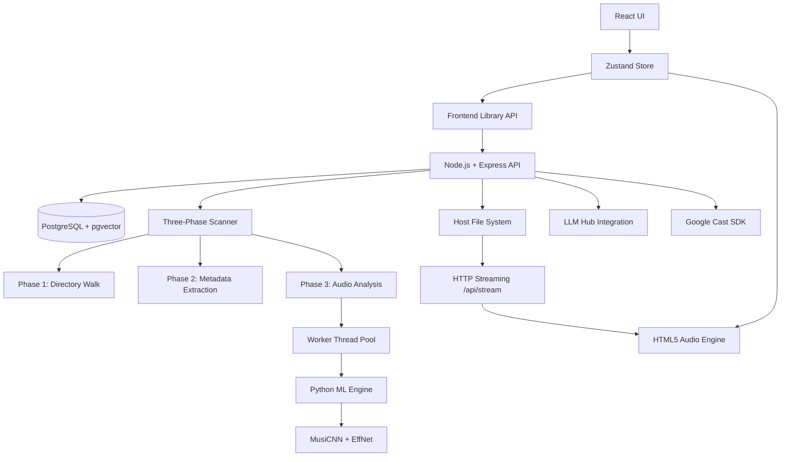

# Architecture Overview

### 1. UI Layer
- **React + TypeScript**: Modular components using Tailwind CSS for responsive styling.
- **Glassmorphism System**: Frosted glass aesthetics with persistent theme context (Light/Dark).
- **React Router**: UUID-based entity navigation with browser history support.

### 2. State & Audio Engine
- **Zustand Store**: Unified state management for library metadata, playback queue, and session settings.
- **PlaybackManager**: Singleton wrapper around `HTMLAudioElement` providing gapless transitions and global playback control.
- **CastManager**: Google Cast (Chromecast) integration for audio streaming to cast devices.

### 3. Backend Infrastructure
- **Node.js + Express**: Manages local file scanning, ID3/Vorbis/ASF metadata extraction, audio serving, and LLM integration.
- **PostgreSQL + pgvector**: Persistent storage for library tracks, mapped directories, playback history, and **1288-dimensional** feature vectors (**8D acoustic** + **1280D Discogs-EffNet** neural embeddings) for similarity search.
- **HTTP Streaming**: Efficient server-side streaming via `Range` headers to support large HQ audio files (FLAC, MP3, WAV, M4A, etc.).
- **Container Orchestration**: Manages the PostgreSQL container via the integrated `containerControl` service.

### 4. Three-Phase Scanner Architecture
The library scanner operates in three distinct phases for transparency and reliability:

1. **Walk Phase**: Recursive directory traversal collecting audio file paths.
2. **Metadata Phase**: Parallel tag extraction using `music-metadata`. Stores track info (title, artist, album, genre, duration) in PostgreSQL.
3. **Analysis Phase**: Audio feature extraction via high-performance worker threads:
   - **Worker Thread Pool**: CPU-intensive analysis offloaded from the main event loop.
   - **Python ML Engine**: Uses Python 3 with TensorFlow-based models for advanced feature extraction.
   - **Smart Seeking**: ffmpeg seeks to the ~35% mark (typically the core of the track) to extract representative features.

### 5. Audio Analysis Pipeline
- **ffmpeg**: Decodes a 15-second segment from the 35% seek point to raw PCM.
- **MusiCNN (8D Acoustic)**: Extracting Energy, Brightness, Percussiveness, Instrumentalness, Acousticness, Danceability, Pitch Salience, and Tempo.
- **Discogs-EffNet (1280D Embedding)**: Neural embeddings for high-fidelity instrument and production texture identification.
- **L2 Normalization**: Embeddings are L2-normalized to ensure compatibility with **Cosine Distance** search.

### 6. Recommendation Engine
- **pgvector + HNSW**: Fast approximate nearest neighbor search on **1280D** vectors (EffNet) and **8D** vectors (Acoustic).
- **EffNet Imputation**: For LLM-generated concepts, the engine synthesizes a 1280D embedding centroid by averaging the embeddings of the closest acoustic neighbors.
- **Genre Penalty**: Real-time re-ranking using an exponential penalty based on "Hop Cost" within the MBDB genre tree.
- **Two-Pool Query**: Balances **Pool A (Genre-Constrained)** and **Pool B (Serendipity/Texture-based)** discovery.

### 7. File System Integration
- **Directory Mapping**: Users provide absolute server paths to ingest local music folders.
- **Non-ASCII Support**: Robust handling of special characters (Danish `øæ`, apostrophes, etc.) via raw Buffer path management.
- **Worker Isolation**: Long-running scanning and analysis tasks are isolated to prevent API performance degradation.
