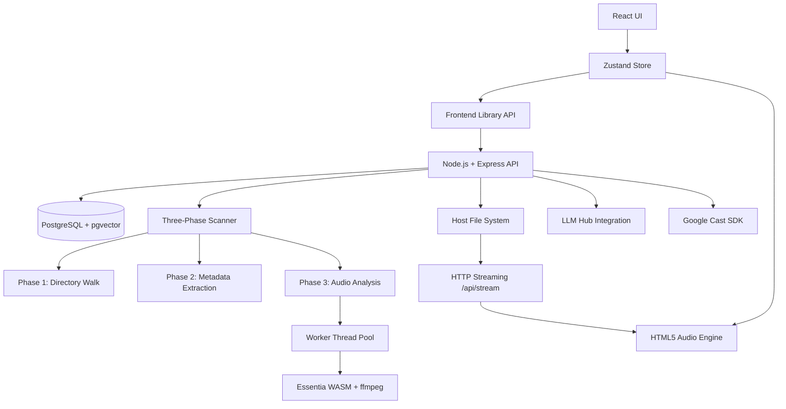

# Architecture Overview

### 1. UI Layer
- **React + TypeScript**: Modular components using Tailwind CSS for responsive styling.
- **Glassmorphism System**: Frosted glass aesthetics with persistent theme context (Light/Dark).
- **React Router**: UUID-based entity navigation with browser history support.

### 2. State & Audio Engine
- **Zustand Store**: Unified state management for library metadata, playback queue, and session settings.
- **PlaybackManager**: Singleton wrapper around `HTMLAudioElement` providing gapless transitions and global playback control.
- **CastManager**: Google Cast (Chromecast) integration for audio streaming to cast devices.

### 3. Backend Infrastructure
- **Node.js + Express**: Manages local file scanning, ID3/Vorbis/ASF metadata extraction, audio serving, and LLM integration.
- **PostgreSQL + pgvector**: Persistent storage for library tracks, mapped directories, playback history, and **1288-dimensional** acoustic feature vectors (**8D acoustic semantic** + **1280D Discogs-EffNet** embeddings) for similarity search.
- **HTTP Streaming**: Efficient server-side streaming via `Range` headers to support large HQ audio files (FLAC, MP3, WMA, etc.).
- **Container Orchestration**: Podman/Docker support for PostgreSQL container management via `containerControl.service.ts`.

### 4. Three-Phase Scanner Architecture
The library scanner operates in three distinct phases for transparency and reliability:

1. **Walk Phase**: Recursive directory traversal collecting audio file paths (MP3, FLAC, OGG, M4A, AAC, WMA).
2. **Metadata Phase**: Parallel ID3/Vorbis/ASF tag extraction using `music-metadata` library. Stores track info (title, artist, album, genre, duration) in PostgreSQL.
3. **Analysis Phase**: Audio feature extraction via worker threads:
   - **Worker Thread Pool**: CPU-intensive Essentia WASM processing offloaded from main thread
   - **Smart Seeking**: ffmpeg seeks to ~35% into track (past intro) for representative chorus/verse analysis
   - **Symlink Workaround**: Non-ASCII filenames handled via temp symlinks in `/tmp/am-*/`
   - **Safe Essentia**: Individual algorithm error handling with graceful fallbacks

### 5. Audio Analysis Pipeline
- **ffmpeg**: Decodes 15 seconds of audio from 35% seek point to raw float32 PCM
- **Essentia.js + Tensorflow**: WASM-based audio analysis extracting 1288-dimensional feature vectors:
  - **8D Acoustic**: Energy, Brightness, Percussiveness, Chromagram, Instrumentalness, Acousticness, Danceability, Tempo
  - **1280D EffNet**: Discogs-EffNet embeddings for high-fidelity instrument and production texture identification.
- **Z-Score Normalization**: Features normalized against rolling library statistics for consistent similarity search

### 6. File System Integration
- **Directory Mapping**: Users provide absolute server paths to ingest local music folders.
- **Non-ASCII Support**: Raw Buffer paths with symlink workaround for special characters (Danish `øæ`, em-dashes, apostrophes).
- **Background Scanning**: Non-blocking worker threads for deep directory traversal, metadata parsing, and audio analysis.

### 7. Recommendation Engine
- **pgvector + HNSW**: Fast approximate nearest neighbor search on **1288D** vectors (8D acoustic + 1280D EffNet)
- **Two-Pool CTE Query**: CTE-based retrieval that balances **Pool A (Genre-Constrained)** and **Pool B (Serendipitous/Texture-based)** discovery.
- **MusicBrainz Taxonomy**: Hierarchical genre classification with LCA-based hop-cost calculation
- **Infinity Mode**: Real-time playlist generation with exponential genre penalty and hybrid 1288D similarity.
- **LLM Playlists**: Vocabulary-guided Creative Director with **EffNet Imputation** (centroid synthesis from acoustic neighbors).

### 8. Utilities & Testing
- **Metadata Parser**: Integrated support for FLAC (Vorbis), MP3 (ID3), M4A, AAC, WMA via `music-metadata`.
- **Worker Threads**: CPU-intensive analysis isolated from main event loop for server responsiveness.
- **Test Suite**: Jest + React Testing Library for verifying store logic and queue manipulation.
