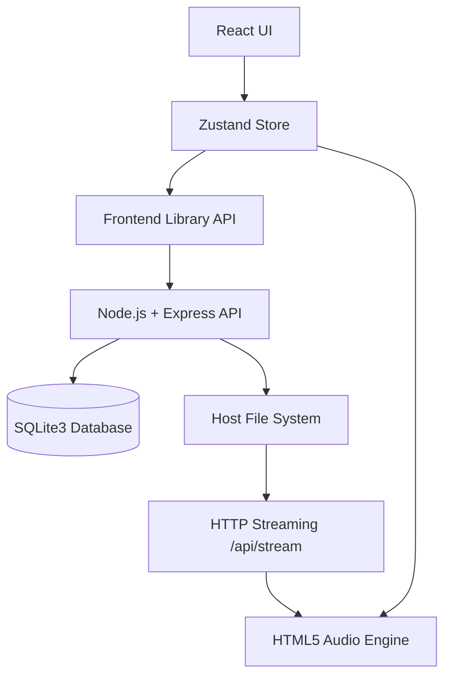

# Architecture Overview

### 1. UI Layer
- **React + TypeScript**: Modular components using Tailwind CSS for responsive styling.
- **Glassmorphism System**: Frosted glass aesthetics with persistent theme context (Light/Dark).

### 2. State & Audio Engine
- **Zustand Store**: Unified state management for library metadata, playback queue, and session settings.
- **PlaybackManager**: Singleton wrapper around `HTMLAudioElement` providing gapless transitions and global playback control.

### 3. Backend Infrastructure
- **Node.js + Express**: Manages local file scanning, ID3/Vorbis/ASF metadata extraction, and audio serving.
- **SQLite3 Database**: Persistent storage for library tracks, mapped directories, and playback history.
- **HTTP Streaming**: Efficient server-side streaming via `Range` headers to support large HQ audio files (FLAC, MP3, etc.).

### 4. File System Integration
- **Directory Mapping**: Users provide absolute server paths to ingest local music folders.
- **Background Scanning**: Non-blocking worker processes for deep directory traversal and metadata parsing.

### 5. Utilities & Testing
- **Metadata Parser**: Integrated support for FLAC (Vorbis), MP3 (ID3), M4A, and AAC.
- **Test Suite**: Jest + React Testing Library for verifying store logic and queue manipulation.
